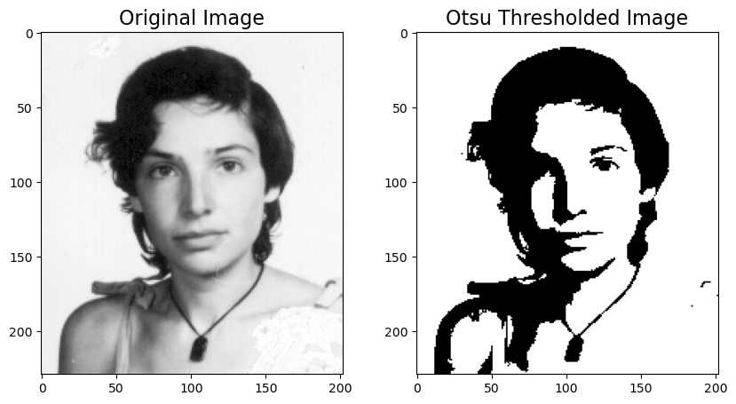
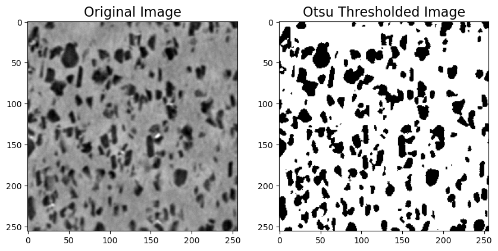
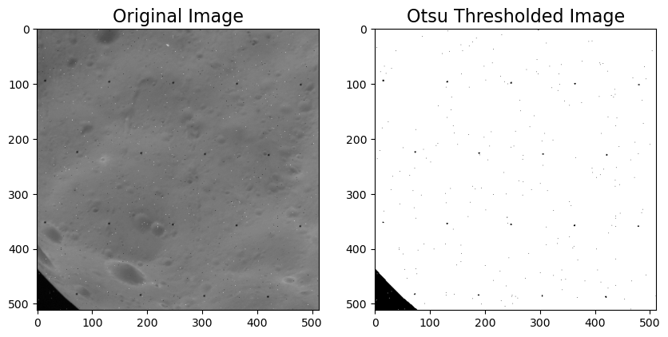

# Otsu Thresholding

This Python script applies Otsu's thresholding method to an input grayscale image. Otsu's thresholding is a technique for automatically finding an optimal threshold value to separate the foreground and background of an image.

## Prerequisites

- Python 3.x
- NumPy
- OpenCV (cv2)
- Matplotlib

## Usage

1. Clone the repository or download the script.
2. Run the script by providing the path to an image as a command-line argument:

   ```shell
   python otsu_threshold.py <image_path>
   ```
Replace <image_path> with the path to your image file.

## Example

Here's an example of how to use the script:

   ```shell
   python otsu_threshold.py julia.tif
   ```
The script will display the original image and the Otsu thresholded image side by side:

<br />
<br />


## Output

The thresholded image is saved in the output/ directory with the filename thresholded_<input_image>. The threshold value is also printed to the console.
